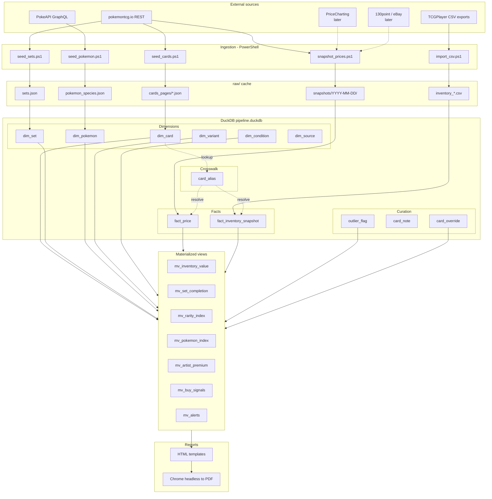

# Pokemon TCG Pricing + Inventory Pipeline — Architecture

## High-level data flow

```
┌────────────────────────── EXTERNAL DATA SOURCES ──────────────────────────┐
│                                                                            │
│  ┌────────────────┐  ┌────────────────┐  ┌────────────────┐  ┌──────────┐ │
│  │ pokemontcg.io  │  │   PokeAPI      │  │  TCGPlayer     │  │ (later)  │ │
│  │  REST API      │  │  GraphQL       │  │  CSV exports   │  │ Price-   │ │
│  │  free          │  │  free          │  │  user-supplied │  │ Charting │ │
│  │                │  │                │  │                │  │ 130point │ │
│  │ • cards (22k)  │  │ • 1025 species │  │ • inventory    │  │ eBay     │ │
│  │ • sets (173)   │  │ • types, gens  │  │ • prices       │  │          │ │
│  │ • daily prices │  │ • evo chains   │  │ • condition    │  │          │ │
│  └────────┬───────┘  └────────┬───────┘  └────────┬───────┘  └────┬─────┘ │
└───────────┼───────────────────┼───────────────────┼───────────────┼───────┘
            │                   │                   │               │
            ▼                   ▼                   ▼               ▼
┌──────────────────────── INGESTION LAYER (PowerShell) ────────────────────────┐
│                                                                              │
│  scripts/seed_sets.ps1     scripts/seed_pokemon.ps1   scripts/import_csv.ps1 │
│  scripts/seed_cards.ps1    scripts/snapshot_prices.ps1   ← (Phase 1 work)    │
│                                                                              │
│   ┌──────────────────────── raw/ cache (idempotent) ───────────────────────┐ │
│   │ sets.json    cards_pages/cards_page001..NNN.json   pokemon_species.json│ │
│   │ snapshots/YYYY-MM-DD/prices.json   inventory_YYYY-MM-DD.csv            │ │
│   └────────────────────────────────────────────────────────────────────────┘ │
└──────────────────────────────────────┬───────────────────────────────────────┘
                                       │  COPY FROM csv
                                       ▼
┌──────────────────────── STORAGE: DuckDB (pipeline.duckdb) ────────────────────┐
│                                                                               │
│  ┌──────── DIMENSIONS (slowly-changing) ────────┐                             │
│  │  dim_set        173 rows                     │                             │
│  │  dim_card     ~22k rows                      │   joined via               │
│  │  dim_pokemon  1025 rows  ◄───── pokemon_key ─┤   normalized               │
│  │  dim_variant    10 rows                      │   name keys                │
│  │  dim_condition  12 rows                      │                             │
│  │  dim_source      5 rows                      │                             │
│  └──────────────────────────────────────────────┘                             │
│                                                                               │
│  ┌──────── CROSSWALK ────────┐    ┌──────── CURATION ────────┐                │
│  │  card_alias                │    │  outlier_flag             │                │
│  │  (TCGPlayer ID → card_id, │    │  card_note                │                │
│  │   PriceCharting ID, etc.) │    │  card_override            │                │
│  │  + quarantine bucket      │    │  (your manual edits)      │                │
│  └───────────────────────────┘    └───────────────────────────┘                │
│                                                                               │
│  ┌──────── FACTS (append-only / snapshot) ────────┐                           │
│  │  fact_price                                     │                           │
│  │    (captured_at, card_id, variant, condition,   │                           │
│  │     source, low, market, mid, high)             │                           │
│  │                                                  │                           │
│  │  fact_inventory_snapshot                        │                           │
│  │    (snapshot_date, card_id, variant, condition, │                           │
│  │     qty, unit_cost_paid)                        │                           │
│  └─────────────────────────────────────────────────┘                           │
└────────────────────────────────────┬──────────────────────────────────────────┘
                                     │  SQL window fns, joins, aggregates
                                     ▼
┌──────────────────── ANALYTICS LAYER (materialized views) ────────────────────┐
│                                                                              │
│  Phase 1:                                                                    │
│   • mv_inventory_value      what your collection is worth right now          │
│   • mv_set_completion       which sets, % owned, value owned vs total        │
│                                                                              │
│  Phase 2+:                                                                   │
│   • mv_rarity_index         price by rarity per set, WoW change              │
│   • mv_pokemon_index        price by Pokemon, normalized index over time     │
│   • mv_artist_premium       Komiya/Arita/etc. premium controlling for rarity │
│   • mv_variant_premium      cosmos vs reverse vs base premium                │
│   • mv_buy_signals          cards trading below cohort baseline              │
│   • mv_sell_signals         cards in your inventory trading above baseline   │
│   • mv_set_arbitrage        singles cost vs sealed EV vs lot estimate        │
│   • mv_alerts               cards needing data attention                     │
└────────────────────────────────────┬─────────────────────────────────────────┘
                                     │
                                     ▼
┌──────────────────────────── OUTPUT LAYER ─────────────────────────────────────┐
│                                                                               │
│  scripts/render_dashboard.ps1                                                 │
│    SQL → JSON → HTML template → Chrome headless --print-to-pdf                │
│                                                                               │
│  reports/                                                                     │
│   • dashboard.html / dashboard.pdf       (overview)                           │
│   • inventory_YYYY-MM-DD.pdf             (snapshot-specific value report)     │
│   • alerts_YYYY-MM-DD.pdf                (action items)                       │
│   • pokemon_trends_YYYY-MM-DD.pdf        (Psyduck/Slowpoke style movers)      │
└───────────────────────────────────────────────────────────────────────────────┘
```

## How this connects to `pokemon/checklists/`

The existing checklist project is a **read-only consumer** of the same canonical
card data:

```
   pokemontcg.io ──► pokemon/pricing/ (DuckDB dim_card)
                            │
                            └──► (Phase 2+) generate.ps1 in pokemon/checklists/
                                 reads dim_card to drive checklist generation
                                 instead of hitting the API ad-hoc
```

For Phase 1 the two projects stay independent. They share input sources but
have separate caches and outputs. We can refactor the checklist generator to
read from DuckDB later if it's useful.

## Mermaid version (for nicer rendering elsewhere)



## Phase boundaries

| Phase | Scope                                                                          | Status      |
|-------|--------------------------------------------------------------------------------|-------------|
| 1     | Foundation: schema, dim_card/dim_set/dim_pokemon/dim_variant/dim_condition,    | **active**  |
|       | TCGPlayer CSV importer, first price snapshot, mv_inventory_value, mv_set_completion |        |
| 2     | Time series: daily price collector on schedule, mv_rarity_index, mv_pokemon_index | planned   |
| 3     | Premiums + signals: artist/variant premium views, buy/sell signal generation   | planned     |
| 4     | Curation: outlier dashboard, override workflow, alerts on stale/missing data   | planned     |
| 5     | Third-party sales: 130point + eBay scraping for graded slabs                   | optional    |

## Known data quality limits (informs Phase 4+)

These are known weaknesses of the current pipeline. They don't break Phase 1–3
analytics but they bound what we can confidently say:

1. **TCGPlayer Market Price is thin at the top of the market.** It aggregates
   marketplace listings, which works fine for high-volume mid-market cards but
   degrades for high-end chase cards (Gold Stars, alt arts, Special Illustration
   Rares, vintage holos) where actual transactions happen only a few times per
   year. The "market price" there is closer to "aspirational seller ask median"
   than realized transaction price. Premium signals for top-of-market Pokemon
   should be treated as directional, not precise.

2. **No condition/grading distinction at the high end.** A raw NM Rayquaza Star
   and a PSA-10 Rayquaza Star are completely different products with completely
   different price discovery, but our current ingestion treats both as condition
   tiers under the same `card_id`. The schema already supports separating them
   via `dim_condition` — we just don't have graded-sale data flowing in yet.

3. **Survivorship in the listing data.** A card with no active TCGPlayer listings
   on a given day is silently absent from the snapshot, which biases rollups
   toward cards that are tradeable. Old / heavily-played / very rare cards are
   under-represented.

4. **Cohort baselines break for sets with heterogeneous supply.** The buy/sell
   signal logic assumes that every card in a `(set_id, rarity)` cohort had
   roughly the same print run, so a card priced way above or below the cohort
   median is a meaningful outlier. This is true for **booster-pack sets** but
   false for **promo sets** (Wizards Black Star Promos, SWSH Black Star Promos,
   SV Black Star Promos, etc.) where a single `set_id` contains everything from
   million-print Walmart blister inserts to 500-print tournament Top-8 awards.

   Empirical evidence from the SVP cohort (181 cards, NM holofoil, current
   snapshot): min $0.28, p25 $0.81, median $1.95, p75 $5.71, **max $112.90**.
   A 400× spread within a cohort that the model assumes is homogeneous.
   Before mitigation, 9.3% of buy signals came from promo sets and scored
   *higher* than regular-set signals (median composite 0.71 vs. 0.42) — pure
   structural artifact, not real undervaluation.

   **Current mitigation:** ALL cohort-based views exclude promo sets
   (`name NOT ILIKE '%Promo%' AND name NOT ILIKE '%Black Star%'` against
   `dim_set`). This covers:
   - `mv_buy_signals` / `mv_sell_signals` — promo cards get no cohort row, so
     they fall out of the INNER JOIN and don't appear in the rankings.
   - `mv_pokemon_premium`, `mv_pokemon_premium_change`,
     `mv_pokemon_premium_by_rarity` — promo cards are excluded from both the
     cohort/rarity baseline AND from the per-Pokemon aggregate.

   The premium views had the SAME flaw in the **opposite direction**: popular
   Pokemon (Pikachu, Squirtle, Bulbasaur) carry dozens of cheap bulk blister
   promos that priced at ~1x the promo-set median, which dragged DOWN their
   aggregate premium. Measured impact: Pikachu's median premium was understated
   by 25% (4.63x reported vs. 6.20x true), Squirtle by 18%, Arceus by 26%. After
   the fix the premium reflects booster-pack cards only, where the cohort
   baseline is meaningful. Charizard barely moved (7.70 -> 7.73) because its
   promos are chase cards, not bulk — a good confirmation the fix targets the
   right distortion.

   Views deliberately NOT filtered (promos are legitimate there): `mv_pokemon_index`
   (sum of value), `mv_top_movers` (per-card price change over time), `mv_set_value`,
   `mv_inventory_value`, `mv_set_completion`.

   **Why not a deeper fix.** The right answer is per-card supply weighting,
   but pokemontcg.io doesn't carry print run data and TCGPlayer's
   "Total Quantity" field is seller-stock not total supply. Without a supply
   data source, the median-cohort approach is incoherent for promos. Possible
   future approaches: snapshot the card's own price history rather than peer
   cohort (needs more snapshots), pull production data from CGC / PSA pop
   reports as a supply proxy (graded population correlates roughly with
   surviving print), or hand-curate a "supply class" attribute per promo card.

   **Same risk exists in milder form for old EX-era full sets** where Energy
   cards and Pokemon Commons sit in the same rarity bucket but have different
   supply, and for **Trainer Gallery / Shiny Vault subsets** when they share
   a `set_id` with the parent set. Trainer Gallery / Shiny Vault are
   actually safe because they each have their own `set_id` (swsh11tg,
   swsh12pt5gg, sma, swsh45sv).

5. **Meta-relevance confounds Pokemon popularity.** Tournament-playable cards
   spike on competitive demand, not collector demand. Lugia VSTAR (Silver Tempest)
   running at $80 during the Lugia/Archeops Worlds 2022-2023 era then crashing
   after rotation has nothing to do with whether the Pokemon Lugia is loved -
   it's pure deck demand. Mew VMAX, Iron Hands ex, Pidgeot ex, every modern
   Trainer (Iono, Boss's Orders, Path to the Peak) have the same problem.
   Our current `mv_pokemon_premium` and `mv_top_movers` views *cannot
   distinguish* these from a Pokemon getting popular. Top movers in the modern
   Rare Ultra / Rare Holo V tier are particularly suspect; vintage holos and
   Common/Uncommon cards are usually safe.

### Mitigations (later phases, schema is already ready)

- **130point and eBay Browse API ingestion** for actual sales above a configurable
  dollar threshold (e.g. >$50). Loaded into `fact_price` with
  `source_id IN ('point130','ebay')` and `dim_source.is_actual_sale = true`.
- **PriceCharting paid tier** for weekly graded-slab historicals. Each grade
  (PSA-10, BGS-9.5, etc.) is already a row in `dim_condition` — just need the
  ingestion path.
- **Outlier flags**: when actual-sale data disagrees with listing-median by more
  than N MADs, flag the listing-median row and let the analytics layer prefer
  the sale-based price.
- **High-end views switch source priority.** Views like `mv_pokemon_premium`
  should, for cards above some dollar threshold, weight `is_actual_sale = true`
  sources higher than listing aggregates.
- **Meta-relevance dimension.** Ingest competitive deck data from sources like
  [limitlesstcg.com](https://limitlesstcg.com), pokemonchallenge.net, or PTCG
  Live deck submissions. Schema additions:
  - `dim_format(format_id, name, started_at, ended_at)` — Standard, Expanded, GLC, etc.
  - `fact_meta_usage(captured_at, card_id, format_id, inclusion_rate, top8_count, win_rate)`
  - `card_alias` already supports it — meta sites need their own `source_id`s.

  Once that fact table exists, `mv_pokemon_premium` and `mv_top_movers` get a
  `meta_score` column and we can split the analytics into two parallel views:
  - **Collector premium**: excludes cards with meta_score above a threshold in
    the relevant time window. The "is this Pokemon getting popular" view.
  - **Composite premium**: includes everything. The "is this card going up
    for any reason" view, used for trade arb / sell-signal alerts.
- **Time-aware meta tagging.** A card's meta status is a function of (card, date).
  Lugia VSTAR is meta in 2023 and not in 2025. The Pokemon-popularity premium
  should compare cards in periods where they had similar meta status, or
  explicitly subtract the meta component.
- **Condition-compression as an internal meta-relevance signal.** Meta cards
  show compressed price ratios across NM/LP/MP/HP/DMG because tournament players
  treat any playable-condition copy as functionally interchangeable. Collector
  cards show wide spreads because grade is everything.

  Empirically validated on the current snapshot (2,935-card sample, holofoil
  variant, prices >= $2 NM):
  - Catalog-wide median HP/NM ratio: **0.41**, median DMG/NM: **0.33**
  - Modern Trainer staples (Iron Hands ex, Iono, Boss's Orders) cluster at
    HP/NM **0.65 - 0.99** — Iron Hands ex Paradox Rift #248 sits at HP/NM = 0.99
  - Vintage holo collector pieces (Dragonite Expedition, Suicune Aquapolis,
    Dragon-era ex cards) cluster at HP/NM **0.12 - 0.30**
  - Iconic vintage that *also* sees casual play (Charizard Base #4) sits at
    HP/NM = 0.47 - on the boundary, useful as a calibration data point

  Proposed signal: a `meta_relevance_score` per (card, snapshot) where:
  - HP/NM > 0.6 reads as meta-relevant
  - HP/NM < 0.3 reads as pure-collector
  - 0.3 - 0.6 is gray zone, needs corroborating evidence (limitless deck data,
    rarity tier, supertype = Trainer)

  Critical confounder: cards released within the last ~18 months have thinner
  played-condition populations, so the ratio is biased upward (looks like meta
  even when it's just collector-only with no played copies in market yet).
  Mitigation: weight by snapshot-count or condition-data-completeness, OR only
  trust the signal for cards with release_date older than N months. A natural
  test: compute the signal at multiple snapshot dates and require stability -
  a genuine meta card stays compressed across time; a brand-new collector card
  starts compressed and decompresses as played supply enters the market.

  This signal is **free** - we already have all 5 condition prices in
  `fact_price`. Worth building as a sanity-check view next to the imported
  limitlesstcg data, since the two should agree on what's meta. Disagreements
  are interesting in themselves.

## Design principles

1. **Raw first, transform second.** Every external pull is cached to `raw/` as
   exact bytes. The DuckDB tables are rebuildable from cache without re-hitting
   any API. This makes re-runs free and makes debugging trivial.

2. **Idempotent ingestion.** Every seed script can be re-run safely. Snapshot
   facts are keyed by `(date, ...)` so re-running a day's snapshot upserts.

3. **Append-only facts.** `fact_price` and `fact_inventory_snapshot` are never
   updated. Time series come naturally; the cost is a few extra MB per month
   which is fine on this data scale.

4. **Quarantine over guess.** When a TCGPlayer product ID doesn't auto-map to a
   `dim_card`, the row goes to `card_alias` with `card_id = NULL` rather than
   being dropped or matched to the wrong card. The curation workflow surfaces
   these for manual review.

5. **Trust hierarchy:** `card_override` > `outlier_flag` (excludes) > raw fact.
   Materialized views read the cleaned + curated view.

6. **No service, no UI yet.** Phase 1 is PowerShell + DuckDB CLI + static HTML.
   We can add a Streamlit/Dash UI later if needed but they're not required.
